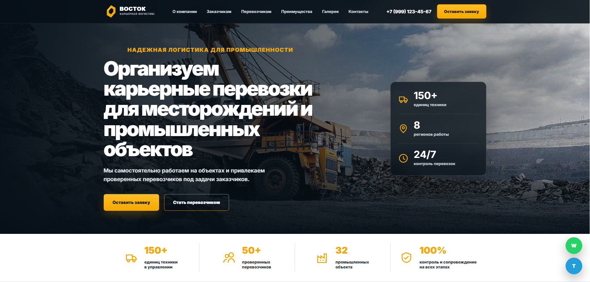
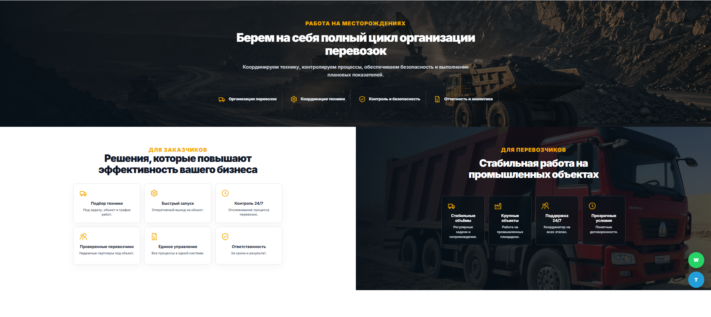

<div align="center">

# 🚛 ВОСТОК

### Корпоративный лендинг для компании, занимающейся карьерными перевозками и промышлененной логистикой

<p>
  
  
  
  
</p>

---

### Современный адаптивный лендинг, разработанный полностью с нуля без использования конструкторов сайтов.



</div>

---

# 📖 О проекте

Данный проект был разработан в качестве работы для портфолио.

Основная задача — создать современный корпоративный сайт для компании, занимающейся организацией карьерных перевозок и логистикой промышленных объектов.

При разработке особое внимание уделялось:

- современному пользовательскому интерфейсу;
- адаптивности;
- скорости загрузки;
- удобству использования;
- чистой структуре HTML и CSS;
- дальнейшему масштабированию проекта.

---

# 🚀 Реализованный функционал

- ✅ Адаптивная верстка
- ✅ Современный корпоративный дизайн
- ✅ Плавные анимации при прокрутке страницы
- ✅ Галерея с миниатюрами изображений
- ✅ Полноэкранный просмотр фотографий
- ✅ Навигация по галерее стрелками
- ✅ Контактная форма
- ✅ Кнопки быстрого перехода в WhatsApp и Telegram
- ✅ SEO-метатеги
- ✅ Open Graph
- ✅ Favicon
- ✅ Hover-анимации элементов
- ✅ Полностью адаптивный интерфейс

---

# 🛠 Используемые технологии

| Технология | Назначение |
|------------|------------|
| HTML5 | Разметка страниц |
| CSS3 | Стилизация интерфейса |
| JavaScript | Интерактивность сайта |
| AOS | Анимации при прокрутке |

---

# 📱 Адаптивность

Сайт корректно отображается на всех современных устройствах:

- 💻 Desktop
- 💼 Laptop
- 📱 Tablet
- 📲 Mobile

---

# 📷 Скриншоты

## Главная страница




---

# 🚀 Запуск проекта

Клонировать репозиторий

```bash
git clone https://github.com/karambel27/vostok-landing.git
```

Перейти в папку проекта

```bash
cd vostok-landing
```

Открыть

```text
index.html
```

или использовать локальный сервер.

---

# 🎯 Чему я научился при разработке проекта

Во время создания проекта я закрепил навыки:

- семантической HTML-разметки;
- построения адаптивных интерфейсов;
- работы с Flexbox и Grid;
- создания интерактивных элементов на JavaScript;
- организации структуры проекта;
- работы с анимациями;
- проектирования пользовательского интерфейса.

---

# 👨‍💻 Автор

**Панов Даниил**


---

<div align="center">

### ⭐ Спасибо за просмотр проекта!

Если проект оказался интересным, буду рад обратной связи.

</div>